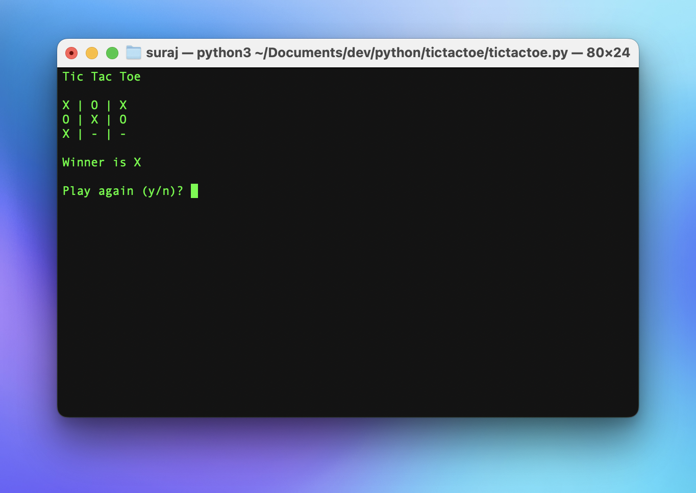

# TicTacToe
A basic tic-tac-toe program built with Python.

The game always starts with the player X. You can play the game by provinding the positions of the gameboard, which ranges from 0-8. 

The board is designed using an array of length 9. It is updated or checked for win/tie after each input from the user.

After there is a win/tie, the game prompts the user to ask if they want to play again.
  If yes: the game resets.
  Else: the game says thank you for playing!
